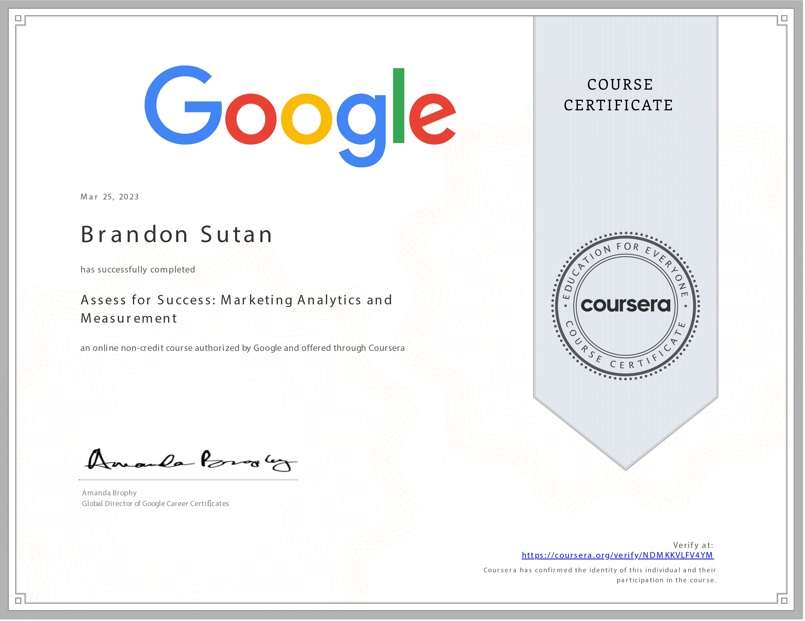

# Assess for Success: Marketing Analytics and Measurement - Course Completed

I'm thrilled to announce the successful completion of the **Assess for Success: Marketing Analytics and Measurement** course! This insightful journey through the realm of marketing analytics and measurement has empowered me with valuable insights, and I'm excited to share my accomplishments.

## Course Overview

- **Course:** Assess for Success: Marketing Analytics and Measurement
- **Duration:** 26 hours
- **Instructor:** Google Career Certificates
- **My Rating:** 4.6

## Unveiling the Power of Marketing Analytics

Throughout this course, I've explored the crucial world of marketing analytics and measurement, gaining profound knowledge on assessing campaign effectiveness. Here are some of the key takeaways that have enriched my perspective:

- **Understanding Media Planning:** I've gained insights into media planning and strategies, enabling me to make informed decisions on optimal channels for reaching target audiences.

- **Elements of a Successful Campaign:** Understanding what constitutes a successful marketing campaign has equipped me with the knowledge to craft strategies that resonate with audiences.

- **Metrics Evaluation:** I've developed the skills to evaluate metrics against performance goals, helping me make data-driven adjustments to marketing budgets and strategies.

- **Effective Reporting:** Acquiring the ability to create presentations and reports allows me to communicate campaign progress, success, and critical insights to stakeholders.

## Acquired Skills

This course has enriched my skill set across various categories, enhancing my proficiency in marketing analytics and performance assessment:

- **Marketing Proficiency:** Strengthening my marketing knowledge is essential for effective analytics, enabling me to make data-driven decisions that align with overarching goals.

- **Customer Loyalty Insights:** Gaining insights into customer loyalty is pivotal for crafting campaigns that resonate with existing customers and foster lasting connections.

- **E-commerce Expertise:** Understanding e-commerce dynamics contributes to developing strategies that drive conversions and optimize online stores.

- **Marketing Analytics Mastery:** Proficiency in marketing analytics empowers me to measure, analyze, and optimize campaign performance effectively.

- **Customer Outreach:** Understanding customer outreach strategies equips me to engage and retain customers through targeted and meaningful interactions.

## Progressing Ahead

With the completion of this course, I'm enthusiastic about implementing advanced marketing analytics techniques and contributing to data-driven decision-making processes.

## Let's Connect

I extend my gratitude to the Google Career Certificates team for providing this comprehensive learning experience. If you're interested in discussing marketing analytics, campaign measurement, or insights from this course, feel free to connect with me on:

Thank you for joining me on this educational journey. Here's to leveraging the power of analytics to drive successful marketing campaigns! 🚀📈
