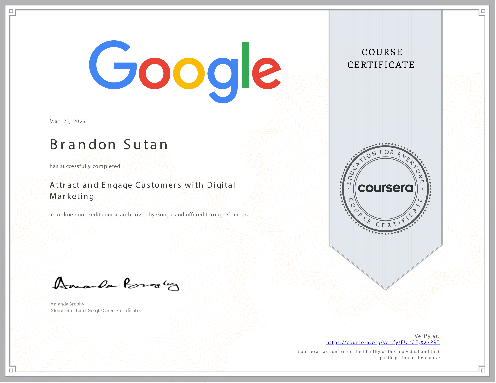

# Attract and Engage Customers with Digital Marketing - Course Completed

I'm thrilled to share that I have successfully completed the **Attract and Engage Customers with Digital Marketing** course! This journey has expanded my horizons in digital marketing strategies, and I'm excited to share my accomplishments and newfound insights.

## Course Overview

- **Course:** Attract and Engage Customers with Digital Marketing
- **Duration:** 21 hours
- **Instructor:** Google Career Certificates
- **My Rating:** 4.8

## Exploring Digital Marketing Strategies

Throughout this course, I've immersed myself in the world of digital marketing, gaining valuable knowledge on attracting and engaging potential customers. Here are some of the key takeaways that have enriched my understanding:

- **Building Brand Awareness:** I've explored strategies to create and enhance brand awareness among potential customers, laying the foundation for successful marketing campaigns.

- **Unlocking the Power of SEO:** Understanding the purpose of search engine optimization (SEO) and essential SEO terms has empowered me to optimize website content effectively for better search engine visibility.

- **Optimizing Website Content:** With the insights gained, I now possess the skills to optimize website content, ensuring that it aligns with SEO best practices and attracts organic traffic.

- **Harnessing Search Engine Marketing (SEM):** I've grasped the significance of search engine marketing and its benefits for businesses, equipping me with the knowledge to create targeted and impactful campaigns.

## Acquired Skills

The skills I've acquired through this course span across various categories, enhancing my proficiency in the field of digital marketing:

- **Fulfillment and Delivery:** Understanding the complete cycle of customer fulfillment and delivery strategies is crucial for ensuring a seamless customer experience.

- **Website Structure:** A well-structured website is essential for user engagement and conversion. I now possess the skills to enhance website layout and user experience.

- **E-commerce Platforms:** Exploring different e-commerce platforms has given me insights into selecting the right platform for businesses to thrive in the digital landscape.

- **E-commerce Strategy:** Acquiring a solid e-commerce strategy is vital for success. I've learned how to craft effective strategies that align with business goals.

- **Seasonality:** Understanding the impact of seasonality on marketing campaigns has provided me with insights to adapt and tailor strategies based on varying customer behaviors.

## Moving Forward

Completing this course has ignited my passion for digital marketing. I'm excited to continue applying these skills and exploring more advanced topics to further excel in the dynamic world of digital marketing.

## Let's Connect

I extend my gratitude to the Google Career Certificates team for providing such a valuable learning experience. If you're interested in discussing digital marketing strategies, website optimization, or insights from this course, feel free to connect with me on:

Thank you for joining me on this educational journey. Here's to embracing the ever-evolving landscape of digital marketing! 🚀📈
