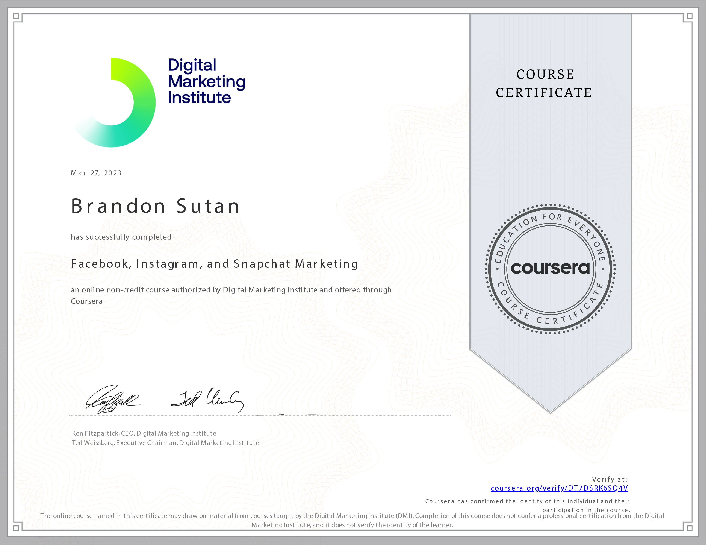

# Facebook, Instagram, and Snapchat Marketing

Welcome to my journey through the course **Facebook, Instagram, and Snapchat Marketing** as part of the **Social Media Marketing in Practice Specialization** offered by the Digital Marketing Institute! This course taught me a comprehensive understanding of leveraging social media giants like Facebook, Instagram, and Snapchat for effective marketing.

## Course Overview

- **Course:** Facebook, Instagram, and Snapchat Marketing
- **Duration:** 11 hours
- **Rating:** 3.8

## Mastering Social Media Advertising

Social media advertising plays a pivotal role in modern marketing strategies. This course has equipped me with the skills to utilize advertising features on platforms like Facebook, Instagram, and Snapchat to engage audiences, tell captivating stories, and drive meaningful interactions.

## Skills Acquired

Throughout this course, I've acquired essential skills for creating impactful advertising campaigns on major social media platforms:

- **Facebook Advertising Mastery:** I've learned to use and optimize the advertising features of the Facebook platform, uncovering campaign insights using native analytics tools.

- **Engaging Storytelling on Instagram:** With best practices for engaging storytelling on Instagram, I'm well-prepared to captivate audiences and establish a compelling brand presence.

- **Snapchat Advertising Strategies:** Learning to get noticed and engage users on Snapchat is a unique skill that adds diversity to my marketing toolkit.

## Putting Knowledge into Action

As I embark on my journey to implement the insights gained from this course, I'm excited to create advertising campaigns that resonate with users on these platforms. By harnessing the power of visual storytelling, I'll be able to foster connections and drive conversions.

## Let's Connect

If you're interested in discussing social media advertising, engaging storytelling, or connecting further, feel free to reach out to me:

Thank you for joining me on this exciting journey into social media marketing on Facebook, Instagram, and Snapchat! 🚀📸
