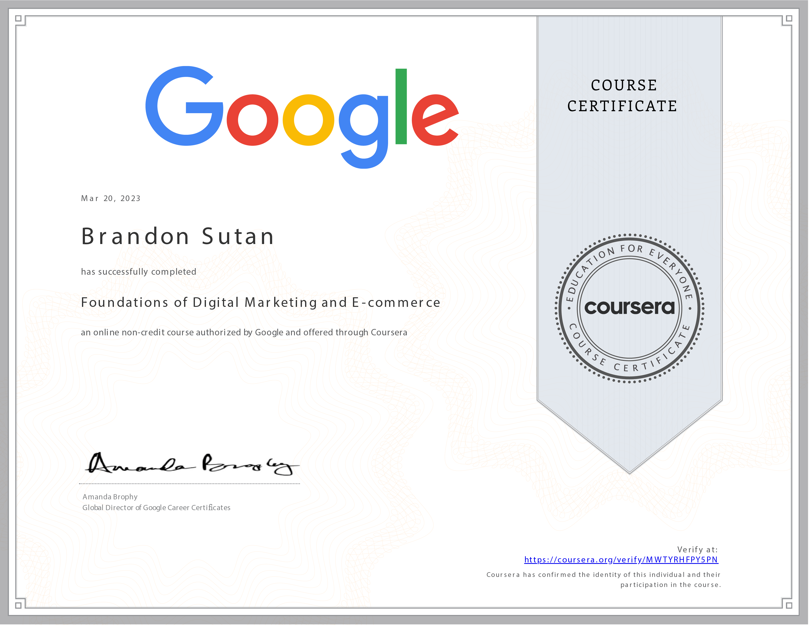

# Foundations of Digital Marketing and E-commerce - Completed

I'm excited to share that I've completed the **Foundations of Digital Marketing and E-commerce** course! This course has been enlightening, and I'm thrilled to reflect on my achievements and insights gained.

## Course Overview

- **Course:** Foundations of Digital Marketing and E-commerce
- **Duration:** 18 hours
- **Instructor:** Google Career Certificates
- **My Rating:** 4.8

## Key Learnings

Throughout this course, I've gained a solid understanding of fundamental concepts in digital marketing and e-commerce. Here are some of the key learnings that have enriched my perspective:

- **Defining Digital Marketing and E-commerce:** I've gained insights into the essential domains of digital marketing and e-commerce, understanding their significance in today's business landscape.

- **Roles and Responsibilities:** I now comprehend the job responsibilities of entry-level digital marketers and e-commerce specialists, providing me with a clearer picture of potential career paths.

- **The Marketing Funnel:** I've grasped the marketing funnel concept and its stages, enabling me to strategize better and engage with potential customers throughout their journey.

- **Elements of Strategy:** Understanding the crucial elements and goals of a digital marketing and e-commerce strategy has given me a foundation for crafting effective campaigns.

## Acquired Skills

This course has equipped me with a range of skills that are valuable for digital marketing and e-commerce endeavors:

- **Social Listening:** I've learned to analyze social media conversations, gaining insights into customer preferences and trends.
- **Social Media Bidding:** Understanding the nuances of social media advertising bids will enable me to optimize campaigns effectively.
- **Customer Engagement:** Acquiring online engagement techniques will be pivotal in building meaningful relationships.
- **Social Media Analytics:** Proficiency in analyzing social media data will aid in measuring campaign success and making informed decisions.
- **Social Media Branding:** Gaining insights into building a solid brand presence on social platforms will enhance my marketing strategies.

## Next Steps

With the completion of this course, I'm inspired to dive deeper into the world of digital marketing and e-commerce. I plan to explore more advanced topics and build practical skills to excel in this dynamic field.

Thank you for being a part of my learning journey. Here's to continued growth and success in digital marketing and e-commerce! 🚀📊
