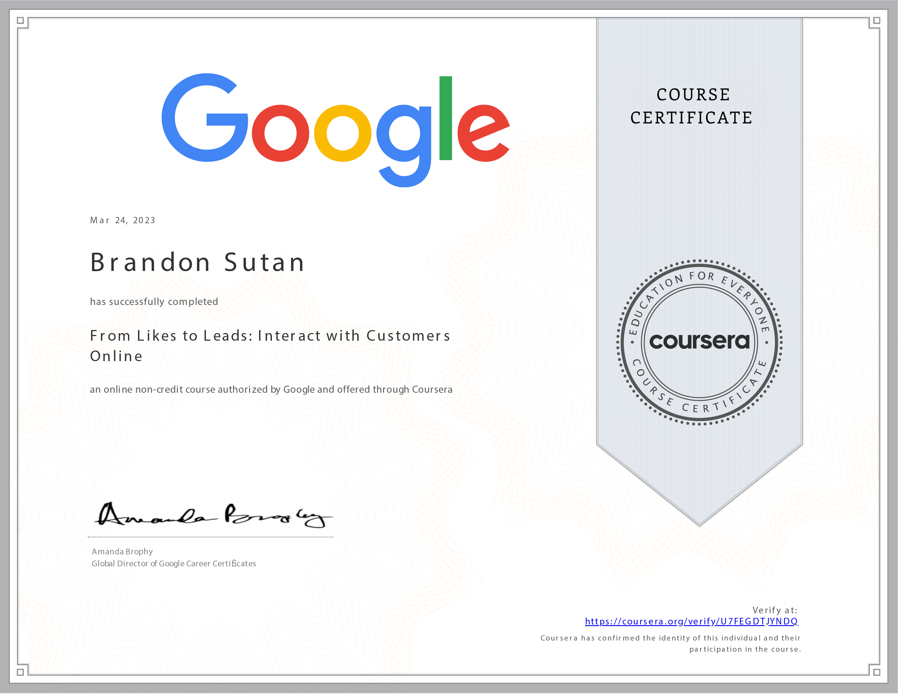

# From Likes to Leads: Interact with Customers Online - Course Completed

I'm excited to announce my successful completion of the **From Likes to Leads: Interact with Customers Online** course! This engaging journey has deepened my understanding of social media marketing and customer interaction strategies, and I'm eager to share my accomplishments and insights.

## Course Overview

- **Course:** From Likes to Leads: Interact with Customers Online
- **Duration:** 26 hours
- **Instructor:** Google Career Certificates
- **My Rating:** 4.8

## Navigating the World of Social Media Marketing

Throughout this course, I've navigated the intricate world of social media marketing, gaining valuable insights into effective customer interaction. Here are some key takeaways that have enriched my perspective:

- **Defining Social Media Marketing:** I've developed a comprehensive understanding of social media marketing, its purpose, and how it plays a pivotal role in modern business strategies.

- **Core Pillars of Social Media Marketing:** Exploring strategy, planning, engagement, analytics, and advertising, I've gained a holistic view of the essential pillars that constitute successful social media campaigns.

- **Setting Campaign Goals:** I now possess the ability to define clear goals for social media campaigns, enabling me to craft strategies that align with business objectives.

- **Crafting Engaging Content:** Understanding the art of writing, designing, and repurposing engaging content for social media has equipped me with the skills to capture and maintain audience attention.

## Acquired Skills

This course has enriched my skill set across various categories, enhancing my proficiency in the realm of social media marketing and customer engagement:

- **Website Structure:** A strong foundation in website structure is crucial for creating effective landing pages and user experiences that drive conversions.

- **Customer Awareness:** Gaining insights into customer awareness strategies empowers me to create content that resonates with the target audience's needs and preferences.

- **Google Tools:** Understanding Google tools provides me with a competitive edge in optimizing campaigns and measuring their impact.

- **Search Engine Marketing (SEM):** I now possess the skills to harness search engine marketing to target and engage customers effectively.

- **Search Engine Optimization (SEO):** Acquiring knowledge of SEO techniques enhances my ability to optimize content for better visibility and reach.

## Progressing Forward

Completing this course has inspired me to explore more advanced concepts in social media marketing and customer interaction. I look forward to applying these skills in real-world scenarios and contributing to impactful marketing campaigns.

## Let's Stay Connected

A big thank you to the Google Career Certificates team for crafting such a valuable learning experience. If you're interested in discussing social media marketing strategies, customer engagement tactics, or insights from this course, feel free to connect with me on:

Thank you for being a part of my learning journey. Here's to creating meaningful interactions and impactful campaigns in the realm of social media marketing! 🚀📊
