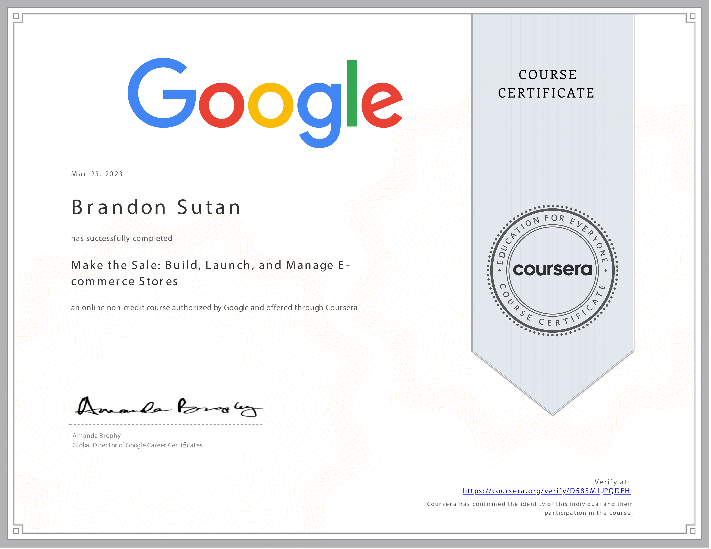

# Make the Sale: Build, Launch, and Manage E-commerce Stores - Course Completed

I'm excited to announce the completion of the **Make the Sale: Build, Launch, and Manage E-commerce Stores** course! This journey through e-commerce strategies and practices has been an enlightening experience, and I'm eager to share my achievements and insights.

## Course Overview

- **Course:** Make the Sale: Build, Launch, and Manage E-commerce Stores
- **Duration:** 24 hours
- **Instructor:** Google Career Certificates
- **My Rating:** 4.8

## Exploring E-commerce Strategies

Throughout this course, I've dived into the intricacies of e-commerce, gaining valuable insights into building and managing successful online stores. Here are some of the key takeaways that have enriched my perspective:

- **Essential E-commerce Concepts:** I've gained a comprehensive understanding of e-commerce strategies and practices, enabling me to craft compelling online store experiences.

- **E-commerce Stores and Platforms:** Understanding the workings of e-commerce stores and platforms has provided me with insights into the digital landscape of online selling.

- **Enhancing Customer Experience:** I now possess the skills to create engaging customer experiences online, incorporating best practices that drive conversions and customer satisfaction.

- **Shopify Implementation:** Acquiring the ability to set up a mock e-commerce store using Shopify has empowered me to apply practical knowledge in an industry-standard platform.

## Acquired Skills

This course has equipped me with valuable skills across diverse categories, enhancing my proficiency in the field of e-commerce and online store management:

- **Digital Marketing KPIs:** Understanding key performance indicators (KPIs) in digital marketing is pivotal for measuring the success of online store strategies.

- **Spreadsheet Management:** Proficiency in spreadsheet management aids in organizing and analyzing data, contributing to effective decision-making.

- **Presenting to Stakeholders:** Gaining skills in presenting to stakeholders is valuable for communicating e-commerce strategies, results, and insights.

- **Media Planning and Strategies:** Understanding media planning and strategies contributes to creating well-rounded and impactful e-commerce campaigns.

- **Marketing Analytics:** Proficiency in marketing analytics enables me to measure, analyze, and optimize e-commerce store performance.

## Continuing the E-commerce Journey

Completing this course has inspired me to continue exploring advanced e-commerce concepts and applying these skills to real-world scenarios. I'm excited to contribute to the thriving world of online sales.

## Let's Connect

Thanks to the Google Career Certificates team for providing such a comprehensive course. If you're interested in discussing e-commerce strategies, online store management, or insights from this course, feel free to connect with me at:

Thank you for joining me on this educational journey. Here's to building and managing successful e-commerce stores that make the sale! 🚀🛍️
