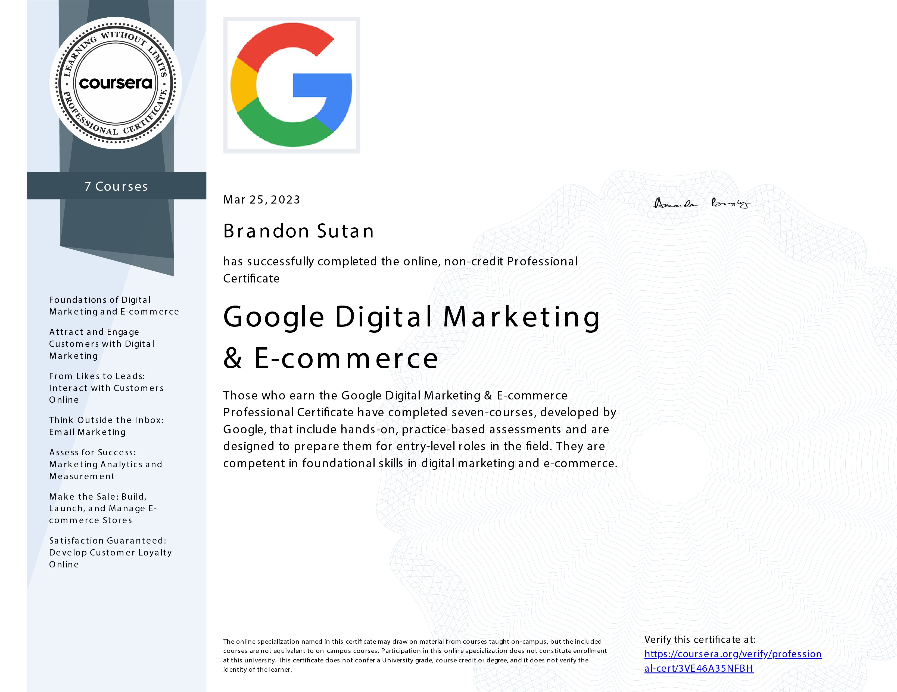

# Google Digital Marketing & E-commerce Professional Certificate

## My Journey to Mastery

I'm proud to share that I have completed the **Google Digital Marketing & E-commerce Professional Certificate** program. This transformative journey has enriched my understanding of digital marketing and e-commerce strategies. This program has equipped me with valuable skills in high demand in today's rapidly evolving business landscape.

## Program Overview

- **Instructor:** Google Career Certificates
- **Instructor Rating:** Top Instructor
- **Number of Enrollments:** 412,667 and counting

## What I've Learned

Throughout the program, I delved into various aspects of digital marketing and e-commerce, gaining practical skills and insights crucial for success in today's digital-driven world. Some key takeaways from my learning journey include:

- **Foundations of Digital Marketing and E-commerce:** I gained a comprehensive understanding of digital marketing concepts, learning to develop effective strategies to engage potential customers and guide them through the marketing funnel.

- **Attract and Engage Customers with Digital Marketing:** Exploring the world of SEO, SEM, and brand awareness, I learned how to optimize website content and use search engine marketing strategies to benefit businesses.

- **From Likes to Leads: Interact with Customers Online:** I honed my skills in social media marketing, understanding core pillars like strategy, planning, engagement, and advertising. This course empowered me to create compelling and engaging content for social media platforms.

- **Think Outside the Inbox: Email Marketing:** I mastered the art of email marketing, from crafting compelling email copy to executing and optimizing email campaigns. Understanding customer engagement and loyalty strategies has been invaluable.

- **Assess for Success: Marketing Analytics and Measurement:** I developed expertise in evaluating marketing metrics, planning successful campaigns, and creating insightful presentations to showcase campaign progress.

- **Make the Sale: Build, Launch, and Manage E-commerce Stores:** This course provided hands-on experience in setting up e-commerce stores, creating an engaging customer experience, and optimizing store performance.

- **Satisfaction Guaranteed: Develop Customer Loyalty Online:** Exploring strategies to build customer loyalty, I learned to manage client relationships, prepare for interviews, and present my achievements effectively.

## Applying Knowledge

This program was not just about theory but about applying practical skills to real-world scenarios. I had the opportunity to work on various projects and assignments that simulated authentic digital marketing and e-commerce challenges. This hands-on approach enhanced my confidence and readiness for the digital marketing landscape.

## Connect with Me

If you're interested in discussing my experiences, digital marketing strategies, or insights from this program, feel free to reach out to me at:

- GitHub: [Brandon Sutan](https://github.com/brandonsutan)
- LinkedIn: [Brandon Sutan](https://www.linkedin.com/in/brandonsutan/)
- Portfolio: [Brandon Sutan](https://brandonsutan.github.io/)

Thank you for joining me on this educational journey. Let's continue to embrace innovation and stay ahead in the dynamic field of digital marketing and e-commerce! 🚀📊
