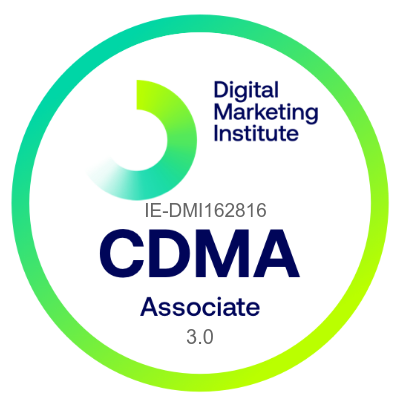

# Digital Marketing Institute - Social Media Marketing in Practice Specialization

Welcome to my journey through the **Social Media Marketing in Practice Specialization** offered by the Digital Marketing Institute! This specialization has equipped me with the skills to thrive in the modern workplace by mastering core social media marketing techniques.

## Specialization Overview

- **Specialization:** Social Media Marketing in Practice
- **Instructor:** Cathal Melinn, Digital Marketing Institute
- **Duration:** 1 month at 10 hours a week
- **My Rating:** 4.4

## A World Transformed by Social Media

With over 4.6 billion people using social media, how businesses operate and engage with consumers has drastically evolved in today's digital landscape. This specialization provides a comprehensive understanding of social media marketing, allowing you to develop a successful career as a digital marketing generalist or social media specialist.

## Courses and Achievements

Throughout this specialization, I've gained invaluable insights into various areas of social media marketing:

- **Social Media and Digital Marketing Fundamentals:** I learned how digital technology influences consumer behavior, the role of content marketing, and how to engage audiences effectively.

- **Social Media and Social Content Strategy:** I explored the benefits of incorporating social media into digital strategy, analyzed influential platforms, and developed content promotion strategies.

- **Facebook, Instagram, and Snapchat Marketing:** I mastered advertising features on Facebook, storytelling techniques on Instagram, and engagement strategies on Snapchat.

- **Twitter, LinkedIn, and YouTube Marketing:** I acquired skills to engage with real-time audiences on Twitter, utilize LinkedIn for B2B advertising, and leverage YouTube's potential.

## Certified Digital Marketing Associate

By completing this specialization, I've earned the esteemed **Certified Digital Marketing Associate** certification from the Digital Marketing Institute. This recognition demonstrates my expertise in social media marketing and opens doors to a community of over 130k members and three months of free Power Membership access.

## Let's Stay Connected

I'm excited to continue applying my newfound knowledge in social media marketing. If you're interested in discussing social media strategies, digital marketing insights, or connecting further, feel free to reach out to me:

- GitHub: [Brandon Sutan](https://github.com/brandonsutan)
- LinkedIn: [Brandon Sutan](https://www.linkedin.com/in/brandonsutan/)
- Portfolio: [Brandon Sutan](https://brandonsutan.github.io/)

Thank you for joining me on this transformative journey in social media marketing! 🚀📱

