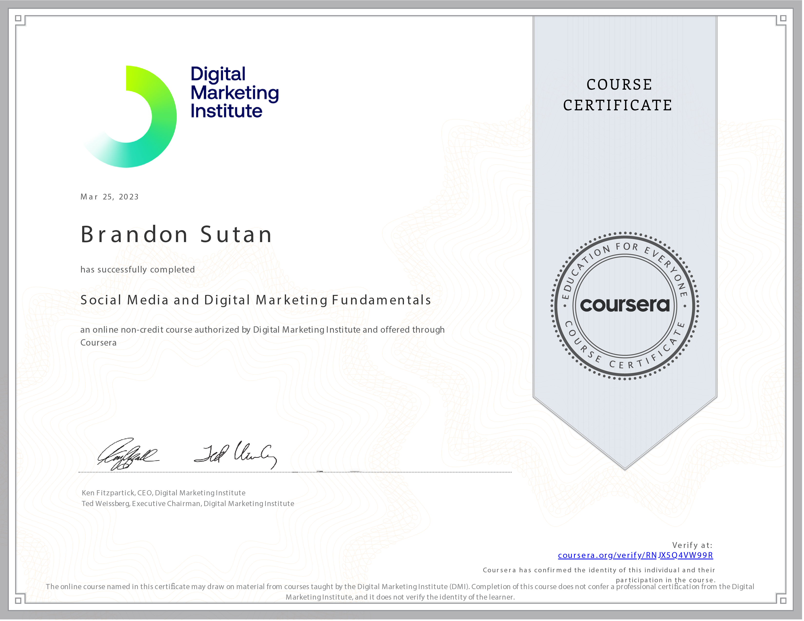

# Social Media and Digital Marketing Fundamentals

Welcome to my journey through the course **Social Media and Digital Marketing Fundamentals** as part of the **Social Media Marketing in Practice Specialization** offered by the Digital Marketing Institute! In this course, I've gained a solid foundation in understanding the intersection of digital technology, consumer behavior, and effective marketing strategies.

## Course Overview

- **Course:** Social Media and Digital Marketing Fundamentals
- **Duration:** 10 hours
- **Rating:** 4.6

## Embracing the Digital Era

The digital landscape has drastically transformed how businesses engage with consumers. In this course, I've delved into the dynamic changes brought by digital, social, and mobile technologies. I've learned to recognize new challenges and opportunities these changes present for businesses.

## Skills Acquired

Throughout this course, I've acquired a range of essential skills that will shape my approach to digital marketing:

- **Understanding Consumer Behavior:** I've gained insights into how digital channels influence consumer behavior and online purchase decisions. This knowledge is crucial for designing effective marketing campaigns.

- **Content Marketing Strategies:** Learning to use the principles of content marketing has enabled me to find, reach, and engage target audiences. The course emphasized the importance of building brand loyalty and advocacy through compelling content.

- **Navigating the Digital Transformation:** By exploring digital transformation, I've gained a deeper understanding of how businesses can adapt and leverage digital technology to stay relevant and competitive.

## Applying the Knowledge

I'm excited to apply the strategies and concepts I've learned in this course to real-world scenarios. As the digital landscape continues to evolve, I'm equipped with the skills to make informed decisions and create impactful marketing campaigns.

## Let's Connect

If you're interested in discussing digital marketing strategies, consumer behavior trends, or connecting further, feel free to reach out to me:

Thank you for joining me on this enlightening journey into the world of digital marketing fundamentals! 🚀📱
