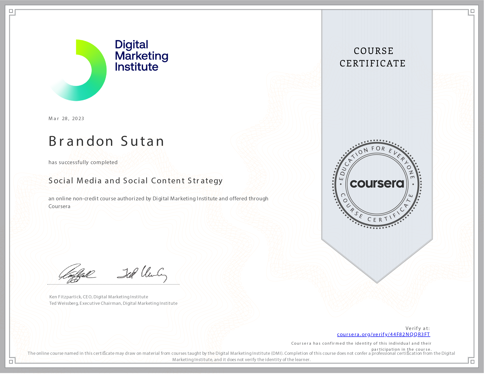

# Social Media and Social Content Strategy

Welcome to my journey through the course **Social Media and Social Content Strategy** as part of the **Social Media Marketing in Practice Specialization** offered by the Digital Marketing Institute! In this course, I've delved into the intricacies of crafting effective social media strategies and content distribution plans.

## Course Overview

- **Course:** Social Media and Social Content Strategy
- **Duration:** 10 hours
- **Rating:** 4.5

## Transforming Businesses with Social Media

In the age of digital transformation, incorporating social media into a business's overarching digital strategy is essential. In this course, I've learned about the substantial benefits and advantages of utilizing social media platforms effectively to engage with target audiences and drive business growth.

## Skills Acquired

Throughout this course, I've acquired essential skills that are fundamental to developing a robust social media presence:

- **Platform Differentiation:** I've learned to differentiate between influential social media platforms and understand their unique advantages for specific audience targeting.

- **Content Promotion Strategies:** Crafting a successful content promotion and distribution strategy is vital. This course has equipped me with the tools to implement, analyze, and optimize these strategies for maximum impact.

- **Building Community and Engagement:** I've explored methods to build and sustain a social media community, fostering engagement and interactions that contribute to brand loyalty and growth.

## Bringing Strategies to Life

As I apply the insights gained from this course, I'm excited to develop social media strategies that align with business goals, engage target audiences, and foster meaningful connections. These strategies will not only drive brand awareness but also contribute to long-term business success.

## Let's Connect

If you're interested in discussing social media strategies, content promotion techniques, or connecting further, feel free to reach out to me:

Thank you for joining me on this enlightening journey into the world of social media and content strategy! 🚀📱
