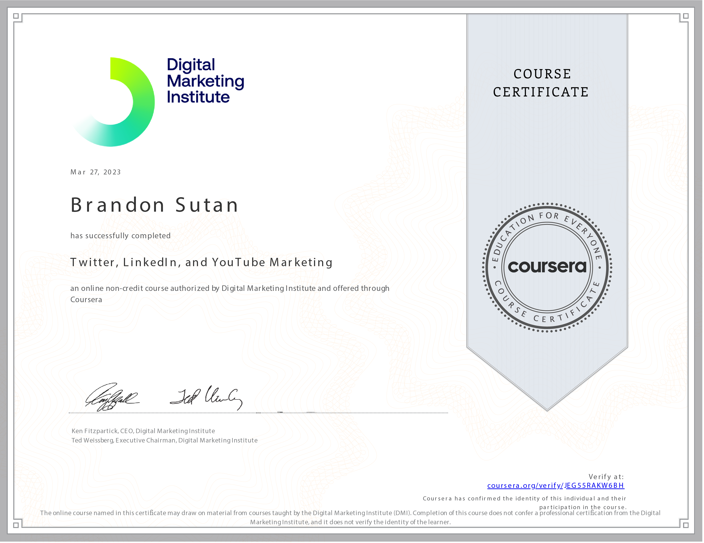

# Twitter, LinkedIn, and YouTube Marketing

Welcome to my journey through the course **Twitter, LinkedIn, and YouTube Marketing** as part of the **Social Media Marketing in Practice Specialization** offered by the Digital Marketing Institute! In this course, I've dived into the art of effective marketing on Twitter, LinkedIn, and YouTube.

## Course Overview

- **Course:** Twitter, LinkedIn, and YouTube Marketing
- **Duration:** 11 hours
- **Rating:** 4.4

## Mastering Diverse Marketing Channels

In the dynamic landscape of social media, mastering different platforms is crucial. This course has equipped me with the skills to harness the potential of Twitter, LinkedIn, and YouTube for reaching and engaging with diverse audiences.

## Skills Acquired

Throughout this course, I've acquired valuable skills that enable me to excel in marketing across multiple platforms:

- **Real-Time Engagement on Twitter:** I've learned how to effectively use Twitter's platform and advertising features to engage with audiences in real-time, creating impactful interactions.

- **LinkedIn B2B Advertising Mastery:** With insights into social selling tactics and LinkedIn's B2B advertising features, I'm well-prepared to connect and engage with prospects on a professional platform.

- **Leveraging YouTube for Reach:** Understanding how to use video and YouTube to reach audiences gives me the ability to tap into the power of visual content.

## Taking Action with Versatility

As I embark on applying the knowledge gained from this course, I'm excited to create strategies that leverage the unique strengths of Twitter, LinkedIn, and YouTube. These platforms provide a diverse range of opportunities to connect, engage, and inspire audiences.

## Let's Connect

If you're interested in discussing multi-platform marketing, social selling strategies, or connecting further, feel free to reach out to me:

Thank you for joining me on this exciting journey into the world of multi-platform marketing on Twitter, LinkedIn, and YouTube! 🚀🌐
